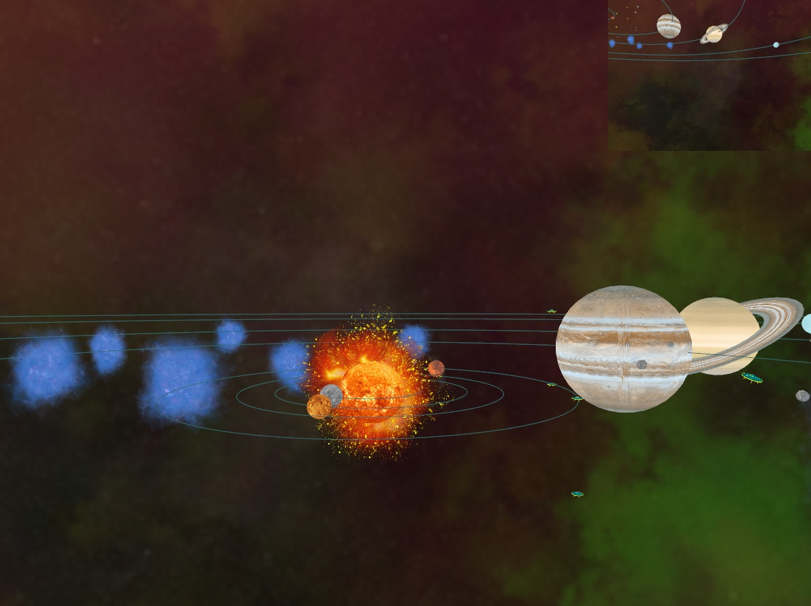
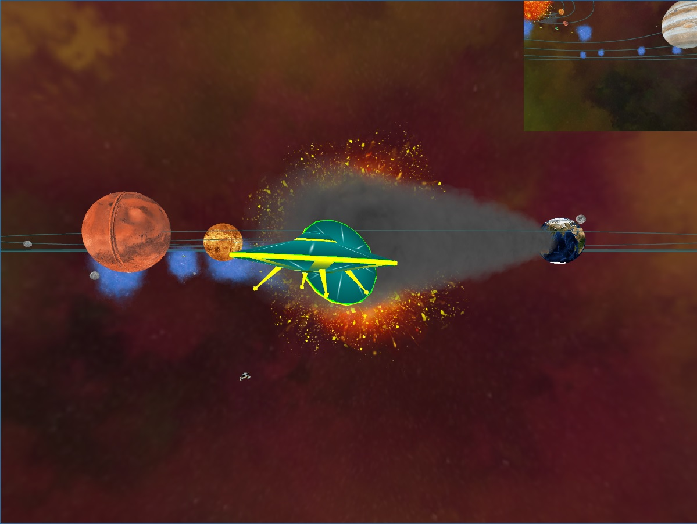
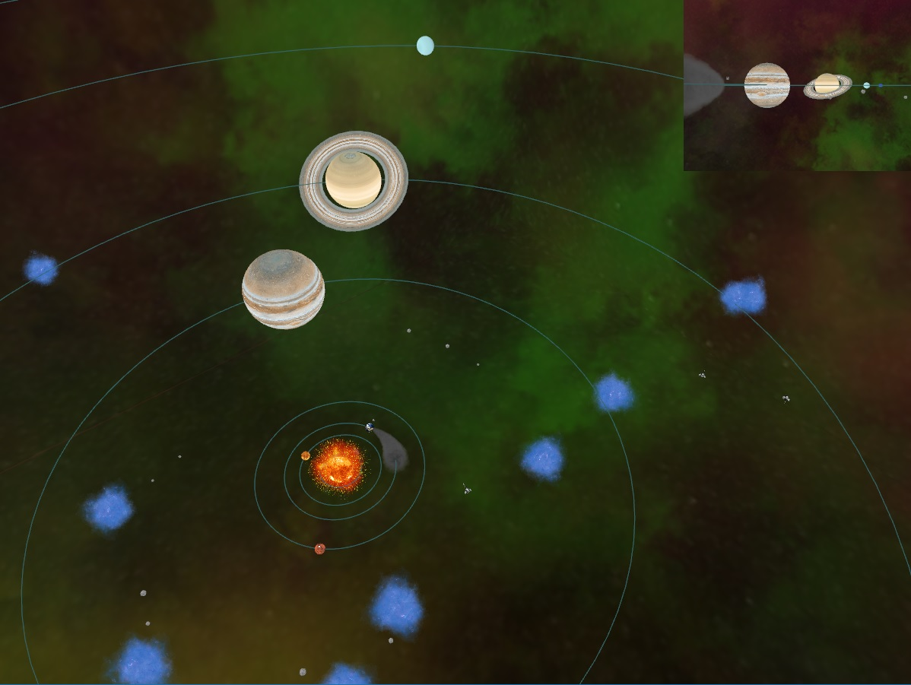

  
  
  

This space simulation was our final project for the Animation for Computer Games course at Concordia University. The simulation features planets, asteroids and "particle storms" that orbit around the sun. The simulation also features space fighter ships that chase down and kill UFOs on contact. The camera can be controlled by the user to fly around the scene, or stay locked on one of the flying spaceships/UFOs. The simulation also features a 2nd viewport in the top right that shows the scene from one of the spaceship's point of view.

In this project I was responsible for implementing the 2nd viewport and all the controls related to the camera: moving through the scene, switching camera target etc.

Where to improve: 
Spaceships rotations are performed using matrix multiplication and Euler angles. The result is harsh motion as the spaceships "snap" into a rotation from one frame to the next. Rotation smoothness could be improved with the use of quaternions and a slerp method.

Code readability suffers from the use of magic numbers. By replacing these with named constants we could increase comprehension and clarify intention.

Full source code is available at the [project repository](https://github.com/zee366/SpaceSimulation).

