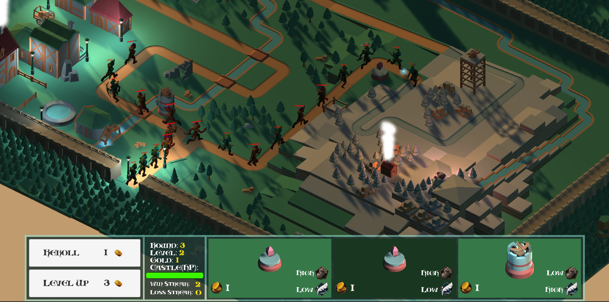

Safeguard the Realm is a game created with Unity as a final project for Introduction to Game Development at Concordia University. The game is a "Tower Defense" game with elements of auto-battlers like Teamfight Tactics, Auto-Chess or Hearthstone's Battlegrounds game mode. The goal of the game is to protect your castle from hordes of goblins that run single file down a road. By placing defensive towers in strategic places along the road, you can keep your castle safe. Players can purchase "3-of-a-kind" of a specific tower type to upgrade it.

The game has 3 levels with progressively harder difficulty due to an increase in the the number of roads that the goblins will run down.

In this project I was responsible for:
The creation of level 2. I pieced together the art assets, added the splines for monster movement, created particle systems for some static objects like houses and water wheels, and added lighting.
I implemented the camera controller, allowing the user to scroll the camera through the scene, zoom in or out and rotate around the center target in 90 degree steps.
I created 2 of our advanced towers: The boomerang tower which launches a projectile on a spline and deals damage to multiple targets, and the lightning tower with its crackling lightning damage effect, which deals damage over time.

 
Full source available at: <a href="https://github.com/zee366/SafeguardTheRealm">Safeguard The Realm</a>
