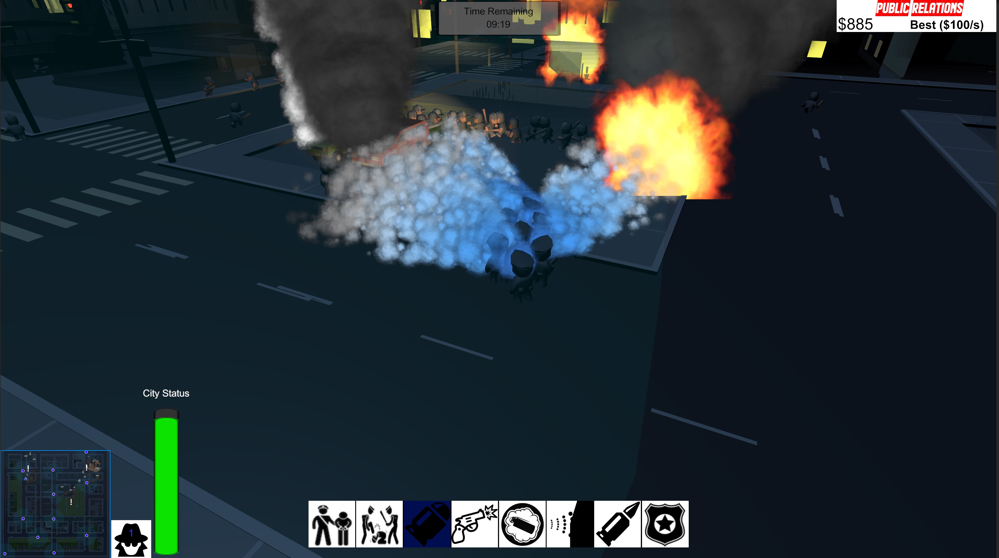
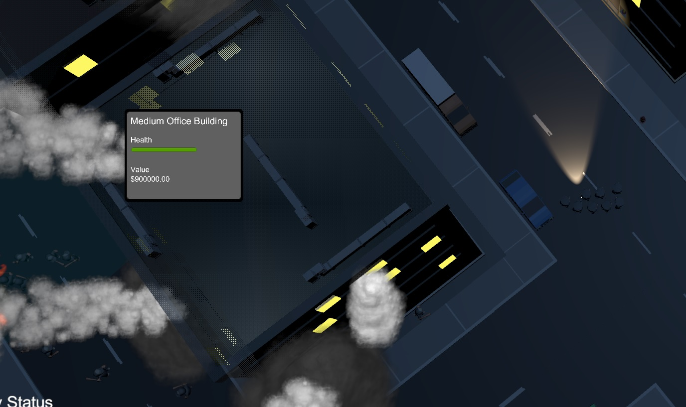

The city is in chaos as rioters run loose, destroying everything in their path! Strategically control your squad of police to deter, contain or otherwise incapacitate the rioters and keep the city safe.

Riot Busters is a game created with the Unity game engine as a team project for Advaced game development at Concordia University. The game contains elements of Real-Time Strategy (RTS) games and crowd simulation.

Spend public funds to power your police abilities such as the water cannon, rubber bullets, smoke grenade, lethal rounds and more. But be careful, using aggressive abilities whilst in view of the numerous reporters will lower your public perception and lower the amount of public funds available.

In this project I was responsible for:

Creating the game level by piecing together over 1000 assets into a realistic city.

Created 3 stages of destruction and accompanying particle effects for buildings and cars. Implemented the logic for the objects to advance through the stages of destruction as more damage is dealt to them.

Created tooltips for destructible objects. The player can view info about an object by clicking on it. The tooltips are displayed on the UI canvas but are anchored to the object itself using WorldToScreenPoint:
```
transform.position = Camera.main.WorldToScreenPoint(_destructible.anchorPoint.position);
```


Created the GameManager that handles win/loss conditions and the SceneManager for level transitions.

Created the opening title scene.

Playthrough of the game available here: https://www.youtube.com/watch?v=1EX6fVJbf7U

Full source available at: <a href="https://github.com/zee366/RiotBusters"><i class="large github icon "></i>Riot Busters</a>

